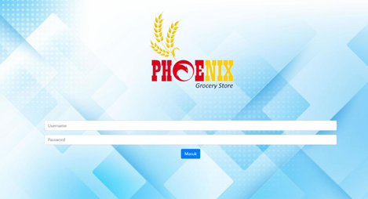
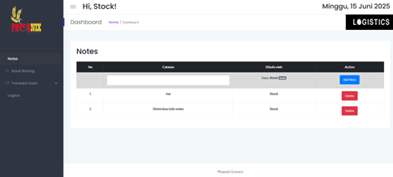

# 📦 Sistem Manajemen Stok Barang – Phoenix Grocery

## 📝 Deskripsi

Aplikasi web ini dirancang untuk membantu **Phoenix Grocery** dalam mengelola stok barang secara digital. Mulai dari proses login admin, pencatatan barang masuk/keluar, pengelolaan data, hingga pencetakan laporan transaksi — semua dalam satu sistem yang praktis dan efisien. 📊📄

---

## ⚙️ Fitur Utama

- 🔐 **Login Admin** – Keamanan akses pengguna
- 📥 **Barang Masuk & Kembali** – Pencatatan stok masuk
- 📤 **Barang Keluar** – Pencatatan stok keluar
- 📦 **Manajemen Stok (CRUD)** – Tambah, edit, hapus, dan lihat data stok
- ⚠️ **Notifikasi Stok Habis** – Peringatan jika stok kosong
- 🧾 **Laporan Transaksi** – Laporan untuk dicetak/download
- 🗒️ **Catatan Admin** – Tambahan informasi penting oleh admin

---

## 🛠️ Teknologi

- 💻 **PHP Native**
- 🗃️ **MySQL**
- 🎨 **HTML, CSS, Bootstrap**
- 🧠 **JavaScript, jQuery**

---

## 📁 File Penting

| File              | Fungsi                                |
|-------------------|----------------------------------------|
| `dbconnect.php`   | 🔗 Koneksi ke database                 |
| `stock.php`       | 📦 Menampilkan data stok barang       |
| `masuk.php`       | 📥 Input barang masuk                 |
| `keluar.php`      | 📤 Input barang keluar                |
| `notes.php`       | 🗒️ Tambah dan kelola catatan admin   |
| `laporan.php`     | 📄 Cetak laporan transaksi            |

---

## 🖼️ Tampilan Web

### 🖥️ Tampilan Login

### 📝 Halaman Dashboard

---

## 👤 Pengguna

- **Admin 👨‍💼** – Akses penuh terhadap seluruh sistem dan data.

---

## 🚀 Cara Menjalankan

1. Install XAMPP
2. Letakkan folder project di direktori `htdocs`
3. Import file database `.sql` (jika tersedia) ke phpMyAdmin
4. Jalankan Apache & MySQL
5. Akses di browser melalui:
